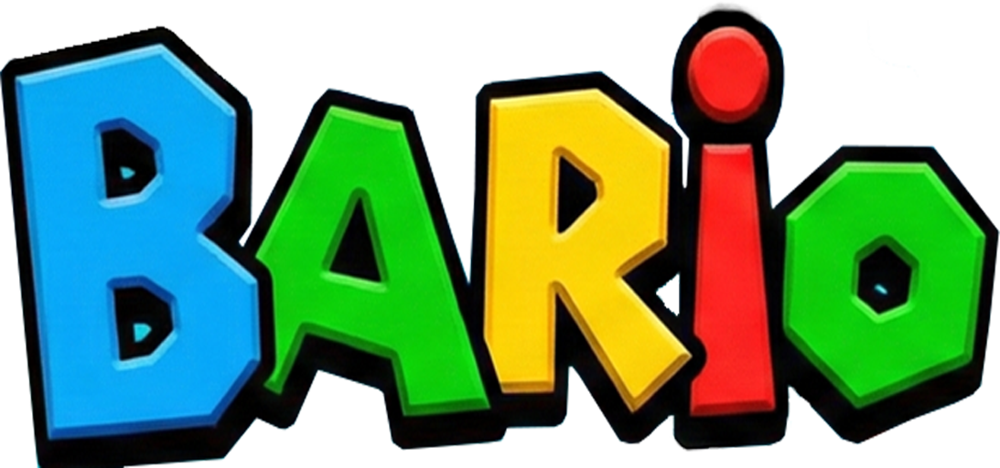

> # Bario (バリオ)
> ****
> **氏名：佐竹 功（さたけ いさお）**
> ---
> 
> 🔗 **リンク**
> * 💻 [GitHub リポジトリ](https://github.com/SatakeIsao/stkBario)
> * 🎥 [YouTube プレイ動画](https://youtu.be/ke94nFQVAqU)

 

# 目次
- [作品概要](#作品概要)
- [担当ソースコード](#担当ソースコード)
- [操作説明](#操作説明)
- [ゲーム説明](#ゲーム説明)
  - [◇ゲーム詳細](#ゲーム詳細)
  - [◇こだわり①：システム](#システム)
    - [独自のトリガー判定システム「GhostBody」](#ghostbody)
    - [「開発環境の構築」と「C++のバグ対策」](#開発環境)
  - [◇こだわり②：UI・UX設計編](#uiux設計編)
    - [「見た目」と「処理」を分けたUIシステム](#uiシステム)
    - [「称号」システムと、ターゲット層に寄り添った設計](#称号システム)
    - [「ポーズ機能」](#ポーズ機能)
    - [「タイマー演出」と没入感を高めるUI配置](#タイマー演出)
    - [「画面シーケンス」の演出](#画面シーケンス)

 

# 作品概要
> <d1>
>  <dt>タイトル</dt>
>  <dd>Bario(バリオ)</dd>
>  <dt>制作人数</dt>
>  <dd>1人</dd>
>  <dt>制作期間</dt>
>  <dd>2026年1月～2026年3月の3か月間
>  <dt>ゲームジャンル</dt>
>  <dd>3Dアクションゲーム</dd>
>  <dt>プレイ人数</dt>
>  <dd>1人</dd>
>  <dt>使用言語</dt>
>  <dd>C++
>   
>  HLSL<dd>
>  <dt>使用ツール</dt>
>  <dd>Visual Studio 2026</dd>
>  <dd>Visual Studio Code</dd>
>  <dd>Adobe Photoshop 2026</dd>
>  <dd>3ds Max 2024</dd>
>  <dd>Effekseer</dd>
>  <dd>GitHub</dd>
>  <dd>Fork</dd>
>  <dd>Trello</dd>
>  <dt>開発環境</dt>
>  <dd>学校内製の簡易エンジン</dd>
>  <dd>Windows11

 

# 担当ソースコード

  ゲーム部分
  

### actor
* Actor.cpp / .h
* ActorState.cpp / .h
* ActorStateMachine.cpp / .h
* ActorStatus.cpp / .h
* BattleCharacter.cpp / .h
* CharacterSteering.cpp / .h
* EventCharacter.cpp / .h
* Gimmick.cpp / .h
* Types.h

### battle
* BattleManager.cpp / .h

### camera
* CameraCommon.cpp / .h
* CameraController.cpp / .h
* CameraManager.cpp / .h
* CameraSteering.cpp / .h

### collision
* BoundingVolume.cpp / .h
* BroadphaseImpl.cpp / .h
* BroadphaseInterface.cpp / .h
* CollisionHitManager.cpp / .h
* GhostBody.cpp / .h
* GhostBodyManager.cpp / .h
* GhostPrimitive.cpp / .h
* PhysicalBody.cpp / .h
* Types.h

### core
* Fade.cpp / .h
* ParameterManager.cpp / .h
* PauseManager.cpp / .h
* PauseManagerObject.cpp / .h
* TaskSchedulerSystem.cpp / .h

### effect
* EffectManager.cpp / .h
* Types.h

### gimmick
* WarpSystem.cpp / .h

### math
* Transform.cpp / .h

### memory
* Allocator.cpp / .h
* Memory.cpp / .h

### scene
* BattleScene.cpp / .h
* BootScene.cpp / .h
* DebugScene.cpp / .h
* GameClearScene.cpp / .h
* GameOverScene.cpp / .h
* IScene.cpp / .h
* SceneManager.cpp / .h
* StartupScene.cpp / .h
* TitleScene.cpp / .h

### sound
* SoundManager.cpp / .h
* Types.h

### ui
* AwardManager.cpp / .h
* AwardMenu.cpp / .h
* BattleSequence.cpp / .h
* GameOverMenu.cpp / .h
* HPBar.cpp / .h
* Layout.cpp / .h
* ManualMenu.cpp / .h
* Menu.cpp / .h
* PauseMenu.cpp / .h
* ResultMenu.cpp / .h
* ReturnToTitleMenu.cpp / .h
* SoundOptionMenu.cpp / .h
* TitleMenu.cpp / .h
* UIAnimation.cpp / .h
* UIAnimationFactory.h
* UIAnimationParameter.h
* UIParts.cpp / .h

### util
* CRC32.h
* Curve.cpp / .h
* JobSystem.h
* ParallelFor.h
* ThreadPool.h
* util.cpp / .h

### Gameディレクトリ直下
* Application.cpp / .h
* main.cpp
* stdafx.cpp / .h
* Types.h
  

   エンジン
   

  
  大文字は改造のみ
  * Bloom.cpp
  * Bloom.h
  * CameraCollisionSolver.cpp
  * CameraCollisionSolver.h
  * CollisionObject.cpp
  * CollisionObject.h
  * FontRender.cpp
  * FontRender.h
  * IRenderer.cpp
  * IRenderer.h
  * **k2EngineLow.cpp**
  * **k2EngineLow.h**
  * LevelRender.cpp
  * LevelRender.h
  * MapChipRender.cpp
  * MapChipRender.h
  * ModelRender.cpp
  * ModelRender.h
  * MyRenderer.cpp
  * MyRenderer.h
  * PointLight.cpp
  * PointLight.h
  * RenderingEngine.cpp
  * RenderingEngine.h
  * SceneLight.cpp
  * SceneLight.h
  * Shadow.cpp
  * Shadow.h
  * Shadowing.cpp
  * Shadowing.h
  * SkyCube.cpp
  * SkyCube.h
  * SpringCamera.cpp
  * SpringCamera.h
  * SpriteRender.cpp
  * SpriteRender.h

   シェーダー
   

   
  * coolTime.fx
  * debugWireFrame.fx
  * gaussianBlur.fx
  * model.fx
  * postEffect.fx
  * drawShadowMap.fx
  * skyCube.fx
  * sprite.fx
 

 

# 操作説明
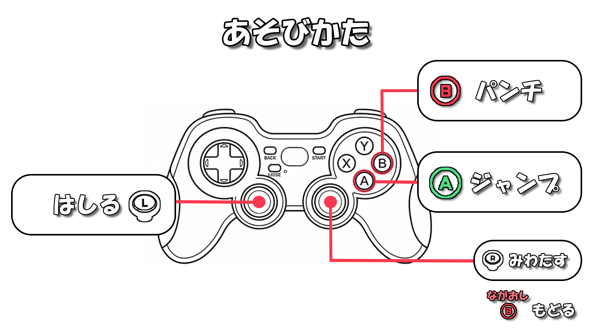

 

[⇧ 目次に戻る](#目次)

---

# ゲーム説明
 

## ◇ゲーム詳細
> ### このゲームは、ジャンプとパンチを使うアクションゲームです。
> ### 制限時間内に、コイン集めたり、スライムを倒しながらゴールに向かうことが目的です。
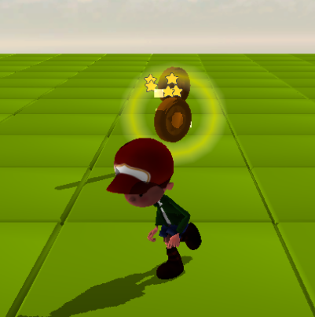
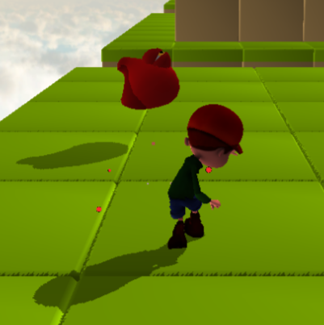

 

[⇧ 目次に戻る](#目次)

---

## ◇技術的なこだわり①：システム

### 独自のトリガー判定システム「GhostBody」
アクションゲームを作るにあたり、最初はすべて物理エンジン（BulletPhysics）を使って当たり判定を行おうとしました。しかし、「攻撃のダメージ判定」や「敵の視野」など、“すり抜けるが、接触だけ検知したい”という処理には、物理エンジンをそのまま使うのは処理が重くて扱いづらいと感じ、自作のセンサーシステム「GhostBody」の作成しました。
ただ動くものを作るだけでなく、「処理負荷を下げる工夫」と「バグが起きにくい設計」にこだわっています。

#### 1. 「総当たり」をやめて処理を軽くする工夫
当たり判定をすべてのキャラクターやギミック同士で計算すると処理落ちしてしまうと学んだため、判定処理を分ける工夫をしました。
まずは「近くにいるペア」だけをリストアップする広域判定を実装しました。さらに、細かい判定をする直前にも、「お互いを囲む大きな球」の距離を測って、そもそも届いていなければ重い計算をスキップする（早期リターン）処理を入れることで、ゲーム全体のパフォーマンスを最適化しています。

#### 2. ビット演算で「誰が何と当たるか」をスマートに管理
制作初期は「もし相手が敵だったら…」という判定処理を `if` 文で書いていたのですが、土管やコインなどのギミックが増えるたびにコードが複雑化し、可読性が低いコードになってしまいました。
そこで、「ビット演算」を使って管理するようにしました。例えばプレイヤーの属性（Attribute）を `1 << 0` にして、当たりたい相手（Mask）を `Enemy | Pipe | Coin` に設定することで、複雑な条件も一瞬のビット計算で判定できるようにしました。これで新しいギミックを追加するのが楽になりました。

#### 3. メモリリークを起こさないための自動管理
攻撃のたびに当たり判定を作ったり消したりしていると、「消し忘れ」によるバグやメモリリークが起きないか不安でした。
そこで、リソース確保と初期化をまとめる手法を意識して設計しました。`GhostBody` が作られたら自動でマネージャーに登録され、デストラクタに自動でリストから外れる仕組みにしています。また `std::unique_ptr` を使うことで、新しいサイズの判定を作り直すだけで古いメモリが安全に消えるようにし、メモリ周りのエラーを未然に防いでいます。

#### 4. 「判定」と「リアクション」を分割
プログラミングを進める中で、「当たったか調べるループ処理」の中で直接HPを減らしたりキャラクターをワープさせたりすると、エラーが起きやすくなることに気づきました。
そこで、専用の `CollisionHitManager` クラスを作りました。当たったペアの情報をいったんリストに保存しておき、すべての判定が終わったあとに、まとめてダメージ処理やノックバック処理を行うようにしました。これで処理の順序が整理され、予期せぬバグを減らすことができました。

 

[⇧ 目次に戻る](#目次)

### 「開発環境の構築」と「C++のバグ対策」
ゲームを制作する中で、「ジャンプの挙動を少し変えるだけでビルドに何十秒も待たされる」「時間差の処理を入れると原因不明のクラッシュが起きる」という問題にぶつかりました。
これらを「根本的なシステム構造」から解決することに挑戦しました。

#### 1. 「JSONホットリロード」
アクションゲームの面白さは「手触り」で決まると考えています。しかし、C++のコードに直接数値を書いていると、微調整のたびにコンパイル待ちが発生し、トライ＆エラーの回数が減ってしまうことに課題を感じていました。
この「ビルド待ち」のストレスを無くし、開発効率を高めるため、独自の「ホットリロード機能」を実装しました。

* **仕組み：** パラメータやUIのレイアウト情報を外部のJSONファイルで管理し、プログラム側でそのファイルの「最終更新時刻」を毎フレーム監視するようにしました。
* **成果：** ゲームを起動したままエディタでJSONを上書き保存すると、即座に最新の数値が画面に反映されます。これにより、ゲームを止めることなく「遊びながら数値を変更する」環境ができ、アクションやUIのクオリティアップにつながりました。

#### 2. 「タスクスケジューラ」
「パンチアニメーションの0.1秒後に当たり判定を出し、さらに0.1秒後に消す」といった遅延処理を安全に実装するため、ラムダ式で処理を予約できる `TaskSchedulerSystem` を自作しました。

* **直面した絶望的なクラッシュ：**
  最初は `std::vector` にタスクを詰め込み、ループで回して実行していました。しかし、「実行中のタスクの中で、さらに新しいタスクが予約される」という状況が発生した瞬間、ゲームが前触れもなくクラッシュするようになってしまいました。
* **原因の究明（イテレータの無効化）：**
  ブレークポイントを置いてメモリを追った結果、ループの最中に配列へ `push_back` されたことで、C++内部でメモリ領域の再確保が走り、参照していたアドレスが破壊される現象が原因だと突き止めました。
* **構造レベルでの解決策：**
  `if` 文などで直すのではなく、タスクのリストを「今のフレームで実行するもの」と「次のフレームに回すもの（`pendingNextFrameEvents_`）」の2つに完全に分離する**ダブルバッファ構造**へ再設計しました。フレームの最後に `swap` を使って安全にリストを入れ替えることで、どんなに複雑な遅延処理が連鎖してもクラッシュしない、スケジューラを完成させました。

 

[⇧ 目次に戻る](#目次)

---

## ◇技術的なこだわり②：UI・UX設計

### 「見た目」と「処理」を分けたUIシステム
ゲーム制作中で、「ボタンの位置を少しずらすだけで、毎回C++のコードを書き換えてビルドを待たなければならない」というUI調整の煩わしさに直面しました。
そこで、UIの仕組みを根本から作り直しました。

#### 1.「UIParts」「Layout」「Menu」の3層構造
最初は「画像の表示」も「座標の指定」も「コントローラーの入力」も全部1つのファイルに書いていたため、どこに何が書いてあるか分からない状態になっていました。これを解決するため、役割を3つのクラスにスッキリ分けました。

* **UIParts（部品）：** 画像やテキストなど、画面を構成する最小単位のパーツです。
* **Layout（見た目）：** 複数の `UIParts` を並べて「1つの画面」を作るクラスです。
* **Menu（裏側の処理）：** 「カーソルを動かす」「決定ボタンを押す」といった入力判定やロジックだけを担当するクラスです。

「見た目（Layout）」と「処理（Menu）」を完全に分けたことで、UIのデザインを直したい時と、ボタンの処理を直したい時で見るべきコードが明確になり、バグが減りました。

#### 2. JSONを使った自動レイアウト
C++のコードに直接「X座標=100、Y座標=200」と書くのをやめ、UIの配置データをすべて外部のJSONファイル（`titleMenu.json` など）にまとめました。
`Layout` クラスは、指定されたJSONファイルを読み込んで、そこに書かれた設定どおりに自動でパーツを配置してくれます。
これにより、ゲームを起動したままJSONの数字を書き換えるだけでUIが動くようになり、微調整のたびに発生していた「ビルド待ちのイライラ」を無くすことができました。

#### 3. 親クラス（Menu）を作ってUI量産のスピードアップ
「タイトル画面」「ポーズ画面」「ゲームオーバー画面」など、複数のUI画面を作るにあたり、フェードイン・アウトやカーソル移動の音など「どの画面でも共通する処理」を親クラスである `Menu` にまとめました。
新しく画面を追加したい時は、この `Menu` クラスを継承して「Aボタンを押したらどうするか」というその画面独自の処理だけを書けば済むように設計したことで、新しいUIを作るスピードが上がりました。

 

[⇧ 目次に戻る](#目次)

### 「称号」システムと、ターゲット層に寄り添った設計
ゲームを「1回遊んで終わり」にせず、何度も繰り返し遊んでもらえるためのやり込み要素として、独自の「称号」システムを実装しました。
ただシステムを作るだけでなく、遊んでくれるターゲット層の目線に立ったUI設計にこだわっています！

#### 1. 過去作の反省を活かしたモチベーション設計
以前制作したゲームでは、やり込み要素が「スコア」と「ランク」のみだったため、遊びのバリエーションが少ないという課題を感じていました。
そこで本作では、プレイヤーの「作業興奮（連続して目標を達成していく気持ちよさ）」を引き出すために称号システムを導入しました。現在15種類の称号を用意しており（随時、追加予定）、様々なプレイスタイルで目標を達成する楽しさを提供しています。

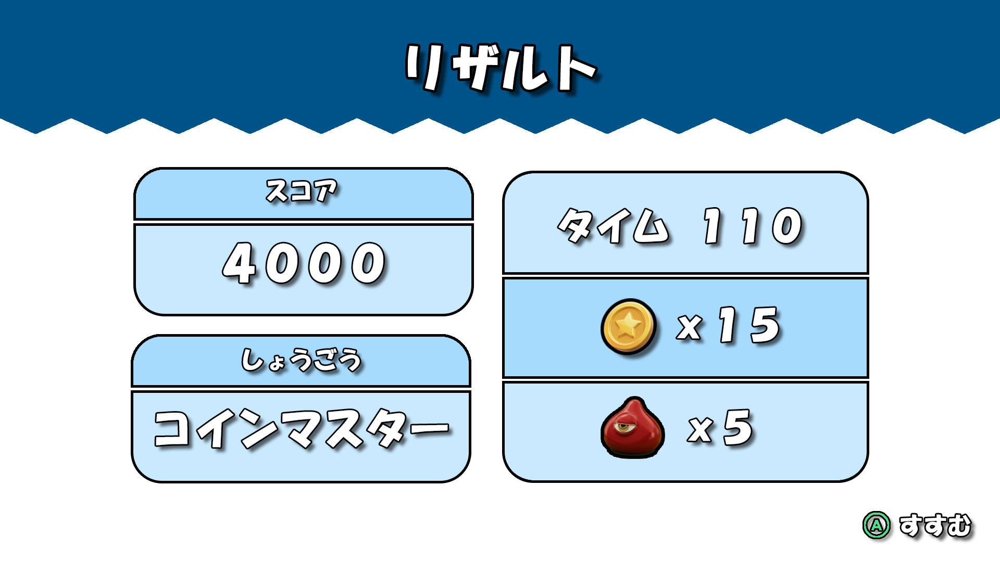

#### 2. 「もう1回遊びたい！」を生み出すゲームサイクル
獲得した称号は、ゲームを閉じるまで状態が引き継がれる仕様にしています。
これにより、1回のプレイでゲームオーバーやクリアになっても、「次はあの称号を狙ってみよう」「あと少しで新しい称号が取れるから、もう1回だけ遊ぼう」という次のプレイへの動機付けを生み出す工夫をしています。

#### 3. ターゲット層に合わせたUI設計
本作のメインターゲットは「小学校の低学年〜中学年」を想定しています。
そのため、称号の獲得条件を隠して手探りで遊ばせるのではなく、タイトルシーンの「しょうごう」ページにて、それぞれの獲得条件を分かりやすく一覧で表示するようにしました。小さな子供でも「何をすればいいのか」が直感的に分かり、自分で目標を立てて遊べる親切な設計を心がけました。

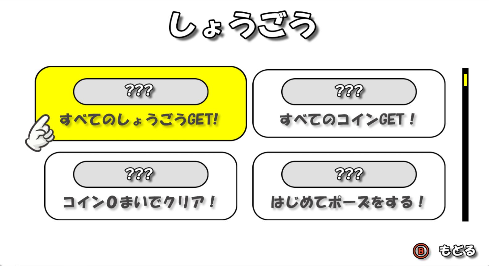

 

[⇧ 目次に戻る](#目次)

### 「ポーズ機能」
ゲームプレイを一時中断した際のストレスをなくし、快適に遊び続けられるように、ポーズ機能の見た目と画面遷移のフローにこだわって実装しました。

#### 1. 「小窓」表示と、メリハリのあるUIレイアウト
ポーズメニューを開いた際、あえて画面全体を黒塗りにせず、「小窓」サイズで表示する仕様にしました。これは、ポーズ中であってもプレイヤーがインゲームの状況（敵の位置や現在の地形など）を視覚的に把握し続けられるようにし、ゲームへの没入感を削がない工夫をしました。
一方で、ゲームの進行と直接関係のない「音声調整」画面に遷移した際は、設定操作に集中できるよう全画面表示に切り替えるなど、画面の目的に合わせてレイアウトの占有率を使い分けています。

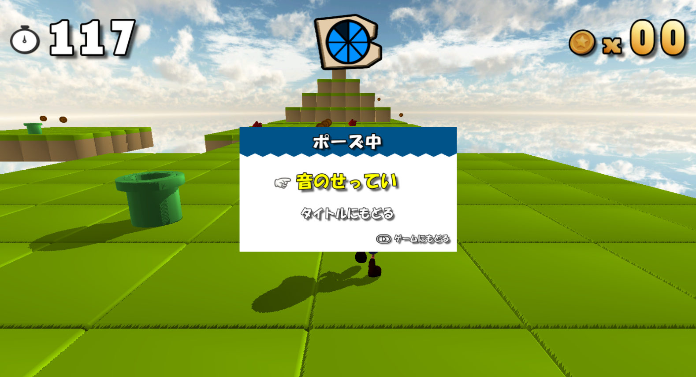
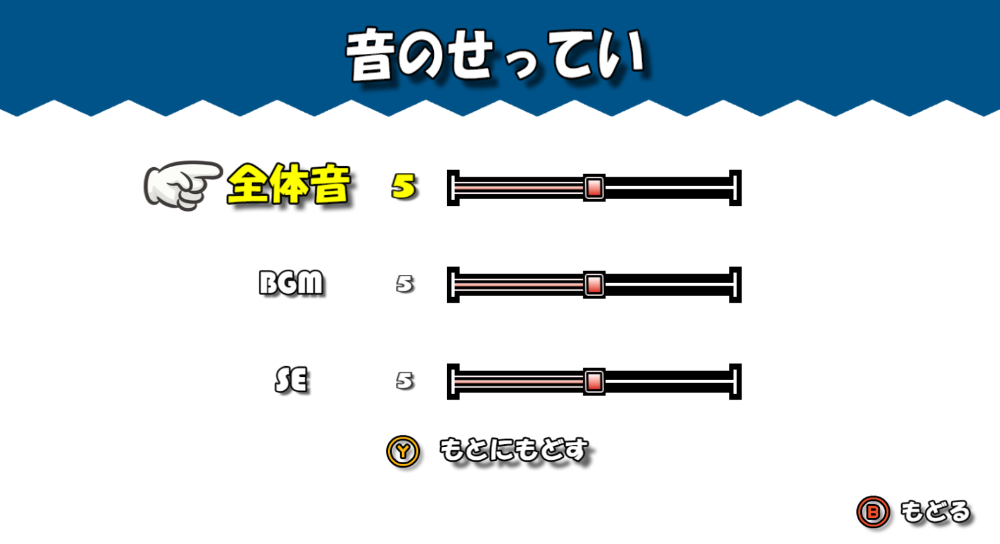

#### 2. シームレスな画面遷移
「少しミスをしたから最初からやり直したい」「一度タイトルに戻りたい」と思ったときに、ストレスなくすぐにやり直せるように、ポーズ画面から直接リトライやタイトルシーンへ遷移できるフローを構築しました。
これにより、遊ぶユーザーがゲーム自体を毎度立ち上げ直す手間をなくし、テンポ良く何度でも繰り返し遊べるゲームサイクルを実現しています。

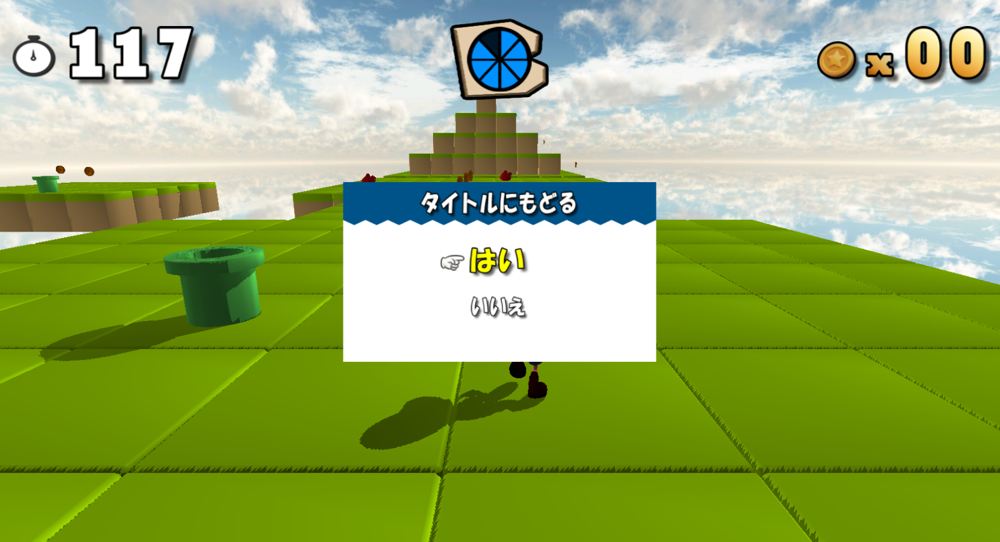

#### 3.安全なUIステート管理
これらの複雑な画面遷移（ポーズ画面 ⇔ オプション画面 ⇔ タイトル遷移確認画面）を行うにあたり、 `PauseManager` という専用のクラスを作成しました。
「小窓を閉じるアニメーションが完全に終わってから、次の画面を開く」といったステート管理を徹底することで、ボタン連打などによってUIが重なったり操作不能になったりするバグを未然に防ぐ、裏側のシステムも構築しています。

 

[⇧ 目次に戻る](#目次)

### 「タイマー演出」と没入感を高めるUI配置
ゲームプレイが単調になるのを防ぐため、制限時間の見せ方と、アクションの邪魔をしない画面レイアウトにこだわってUIを設計しました。

#### 1. タイマーアニメーション
ただ数字が減っていくだけでは、アクションに集中しているプレイヤーの意識に上りにくいと考えました。そこで、残り時間が「100秒・50秒・30秒」の区切りになった瞬間に、UI全体を少し拡縮させ、一瞬点滅させるアニメーションを取り入れています。
これにより、プレイヤーが常に画面の端を見ていなくても、視界の隅の動きで「時間が減ってきたな」と直感的に気づける仕組みを作りました。

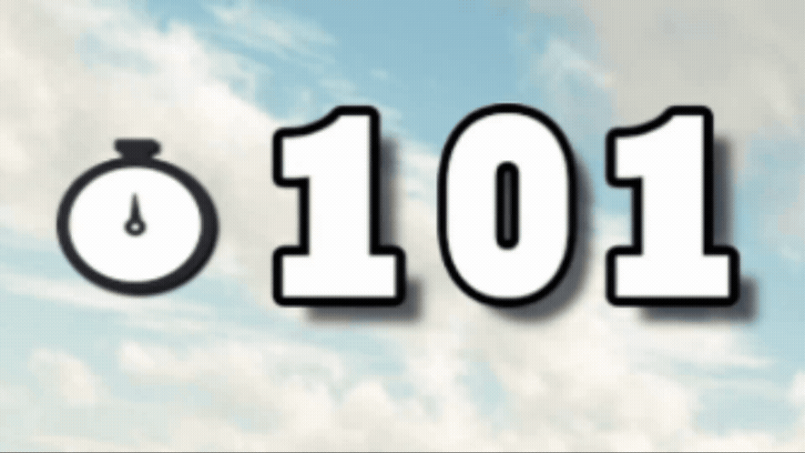

#### 2. 「赤点滅」
残り時間が30秒を切ると、タイマーが赤く点滅し続けるように変化します。
これは「もう時間がない！」という警告をあおるための工夫です。ゲームの終盤に向けてあえてプレイヤーを焦らせることで、プレイ体験が単調にならず、クリアした時の達成感がより大きくなるようにゲームのメリハリをコントロールしました。

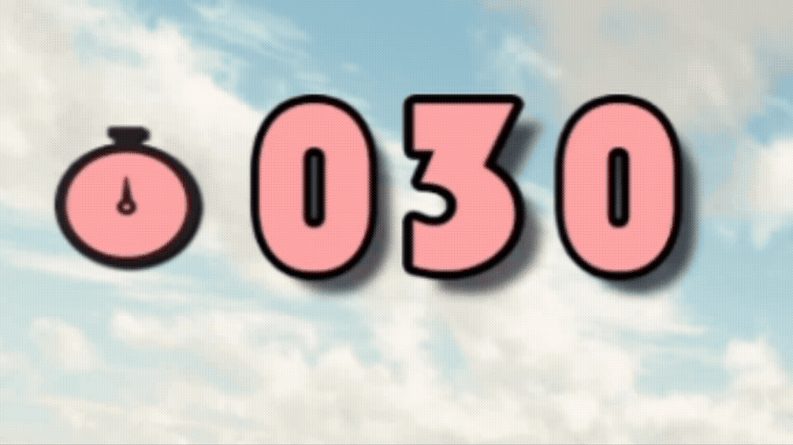

#### 3. 没入感を最優先した画面レイアウト
タイマーを画面の左端に配置しているのには、理由があります。
タイマーだけでなく、HPバーやコインの獲得数といったプレイ中の情報は、すべて画面の端に寄せて配置しました。これは、プレイヤーの視線が集中する「画面中央（キャラクターのアクションや敵の動き）」をUIで隠してしまわないようにするためです。
操作の邪魔をせず、ユーザーがゲームの世界にしっかりと没入できる画面設計を心がけました。

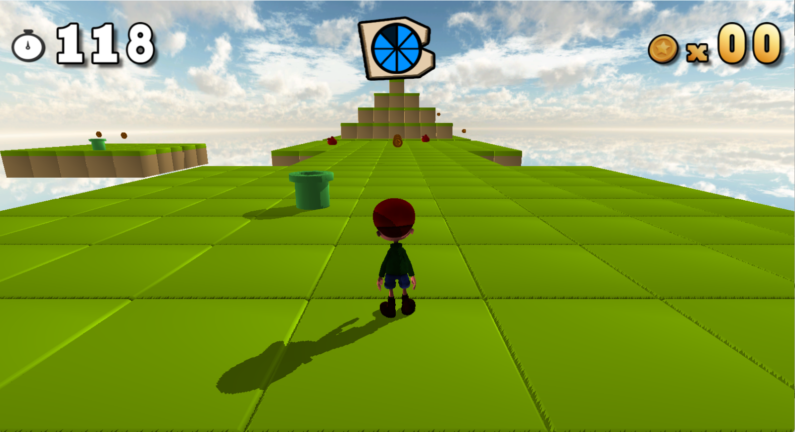

 

[⇧ 目次に戻る](#目次)

### 「画面シーケンス」の演出
テキストをただ画面に出すだけでなく、UIのアニメーションを通してユーザーの感情を揺さぶり、ゲームへの没入感を高める「演出」にこだわりました。

#### 1. 「READY... GO!」の演出
ゲームが始まった瞬間、ユーザーの意識を一気にゲームの世界へ没入させるため、「READY... GO!」の演出に緩急をつけました。
* **READY：** 文字を徐々に「縮小」させることで、スタートダッシュに向けてギュッと力を溜めているような「ブレーキ」を表現しています。
* **GO!：** 溜めた力を一気に解放するように文字を「急拡大」させ、同時にアルファ値を下げて、フェードアウトする動きにしました。
これにより、ユーザーがキャラクターを動かし始める瞬間の「疾走感」をUIの動きで後押ししています。

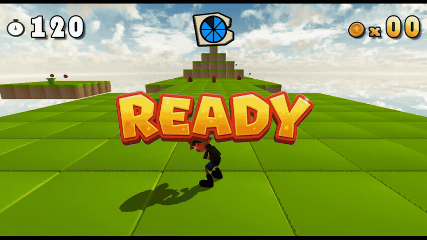

#### 2. リザルトアニメーション
ゲームクリア、ゲームオーバー、タイムアップのそれぞれで、ユーザーが感じるべき感情（達成感や残念感）に合わせた専用のアニメーションを実装しました。
* **ゲームクリア（達成感）：** 文字をに一気に拡大させた後、少し縮小して元のサイズにピタッと収まる「オーバーシュート」のアニメーションにし、目標を達成した気持ちよさと勢いを表現しました。

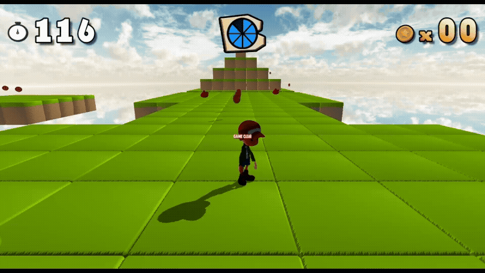

* **ゲームオーバー（残念感）：** 文字が上から落ちてきて重たく「バウンド」するアニメーションにすることで、失敗してしまった時のがっかり感を表現しています。

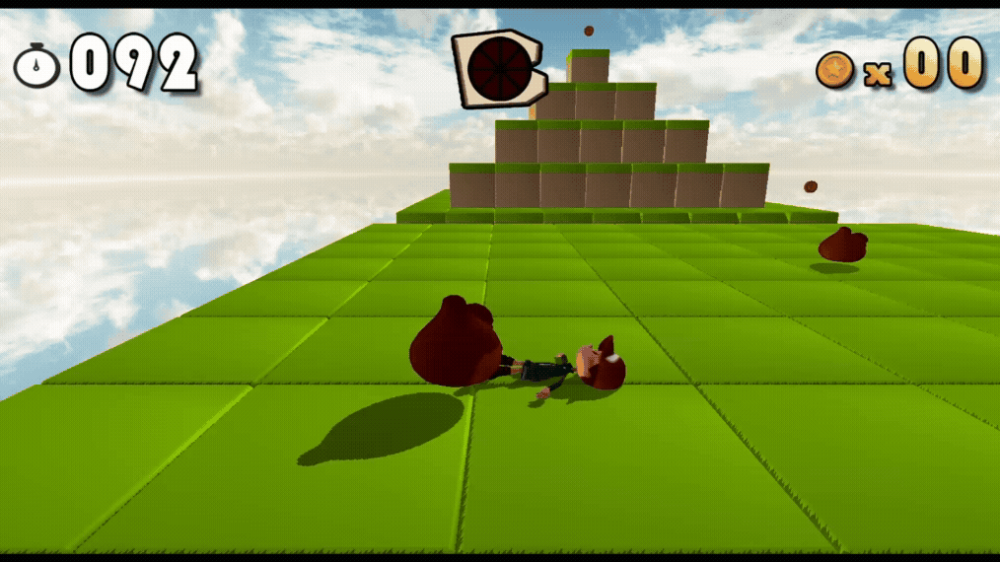

* **タイムアップ（急停止）：** 文字が右から左へ勢いよくスライドし、急ブレーキを踏んだように止まるアニメーションにし、「不意に時間が切れてしまった！」というハッとする感覚を演出しました。

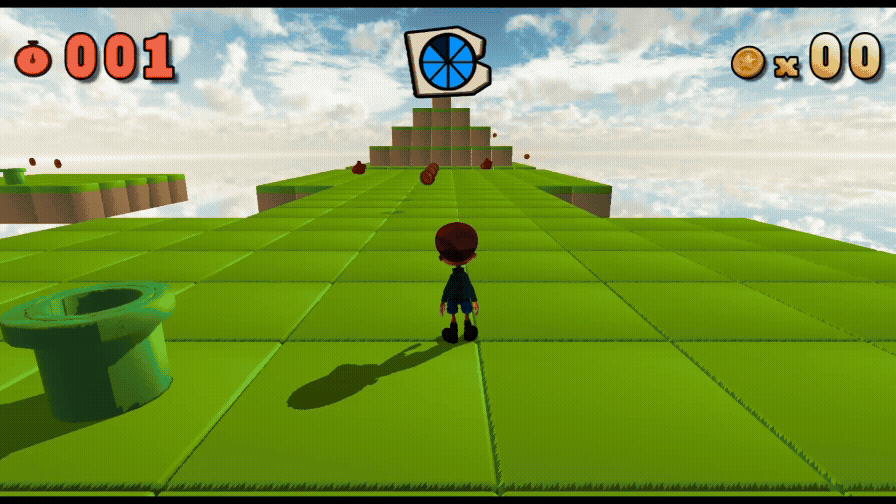

#### 3. 演出を支える自作のアニメーションシステム
これらの複雑なシーケンス演出は、毎フレーム座標やスケールを手書きするのではなく、自作した `UIAnimation` クラスと `TaskSchedulerSystem` を組み合わせて制御しています。
「何秒後に、どのイージングで、どんなアニメーションを再生するか」をデータとして管理することで、演出のタイミング調整や試行錯誤がスムーズに行える環境を作成しました。

 

[⇧ 目次に戻る](#目次)